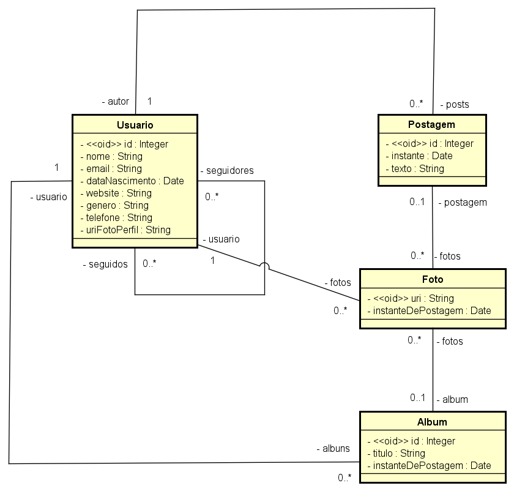
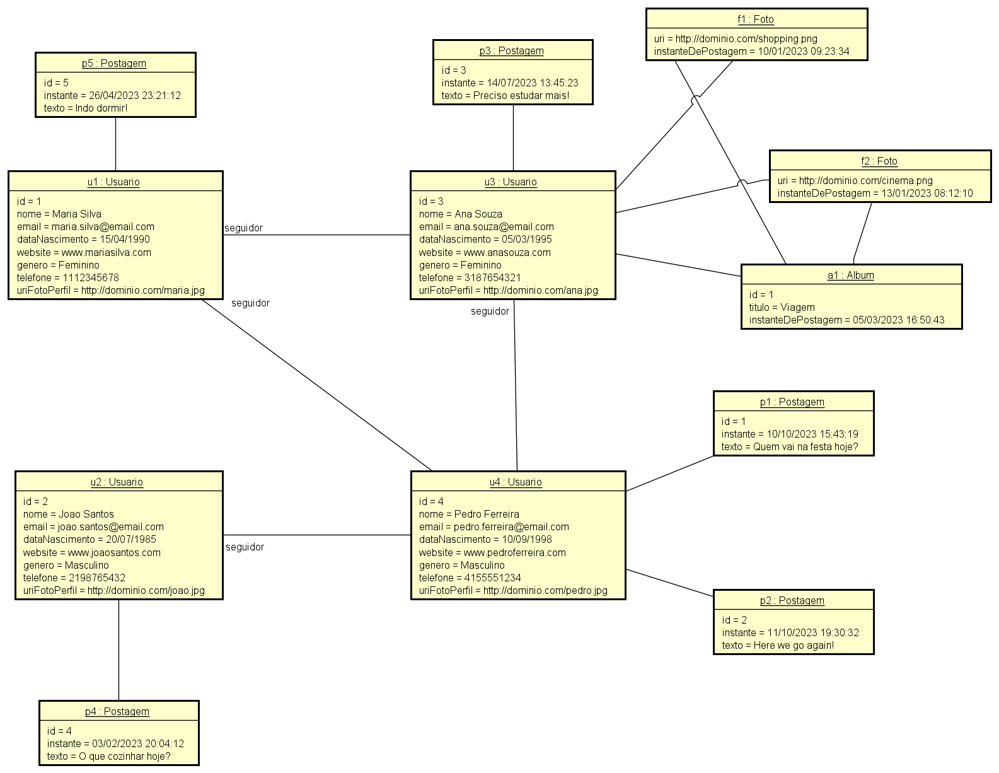

# 💻 Modelo Conceitual - nível de análise

## 📝 Exercícios PARTE 2: Associações e multiplicidade de papéis
Para cada exercício, fazer:
- Desenhar o Modelo Conceitual
- Esboçar uma instância atendendo os requisitos mínimos pedidos

### Exercício 3

Deseja-se fazer um sistema de rede social. Nesta rede social, os usuários podem seguir e ser seguidos por outros usuários. O perfil do usuário deve permitir cadastrar nome, email, data de nascimento, website, gênero, telefone e foto do perfil. Os usuários podem fazer postagens de texto em sua própria "linha do tempo" (timeline) da rede social, sendo que podem anexar também fotos às postagens. Uma foto é referenciada pela URI de seu local de armazenamento. As fotos podem ser organizadas em álbuns, sendo que cada álbum possui um título.

*Instância mínima: 4 usuários, pelo menos um usuário com mais de uma postagem, pelo menos um álbum com mais de uma foto.*

### Resolução

#### Modelo Conceitual

#### Instância
