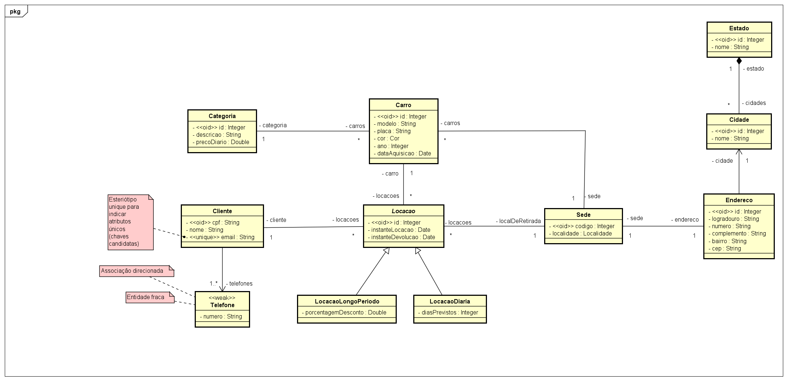
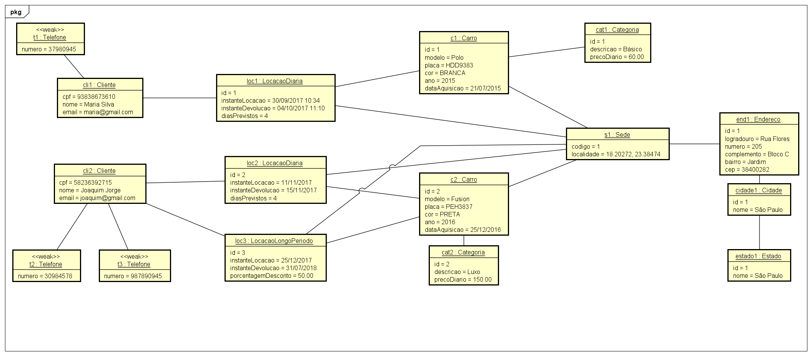

# 💻 Modelo Conceitual - nível de análise

## 📝 Exercícios PARTE 4: Herança, Enumerações e Tipos Primitivos
Para cada exercício, fazer:
- Desenhar o Modelo Conceitual
- Esboçar uma instância atendendo os requisitos mínimos pedidos

### Exercício 1

Uma locadora de carros deseja fazer um sistema para armazenar as informações das locações que os clientes fazem. A locadora possui diversas sedes, sendo que cada sede possui um código e uma localidade, sendo que uma localidade é armazenada internamente por dois números de ponto flutuante (exemplo: a localidade 18°56'04.4"S 48°17'29.7"W é armazenada como -18.9345654, -48. 915811). Para cada locação é necessário registrar a data e horário em que o cliente pega o carro, bem como a sede da qual o carro foi retirado. Há dois tipos de locação: a diária e a de longo período. Quando a locação for diária, deve-se armazenar o número de dias previstos para devolução do carro. Quando a locação for de longo período, deve-se armazenar a porcentagem de desconto dada no valor da diária. Em todos os casos, a data e horário em que o carro foi devolvido devem ser armazenados. Os dados de cada carro são modelo, placa, cor, ano e data de aquisição. A locadora trabalha somente com carros de cor branca, preta, cinza e vermelha. Os dados dos clientes são nome, cpf, email e seus telefones. Cada carro pertence a uma categoria, sendo que cada categoria de carro possui um valor de diária de locação.

*Instância mínima: 1 cliente, 2 carros, 3 locações.*

### Resolução

#### Modelo Conceitual

#### Instância
