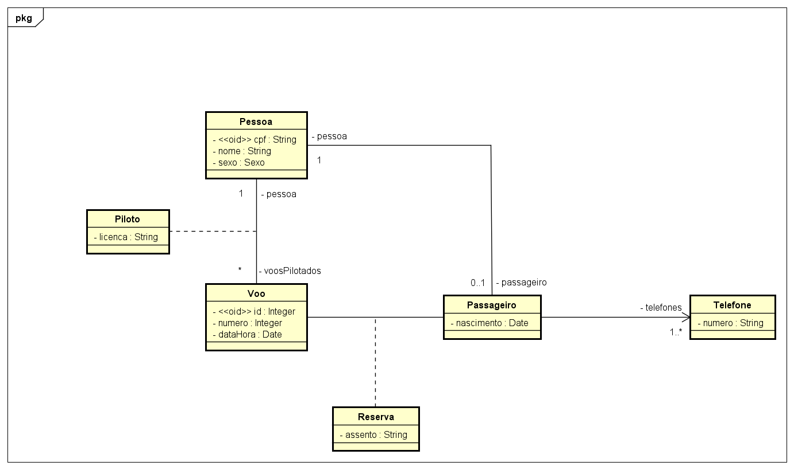
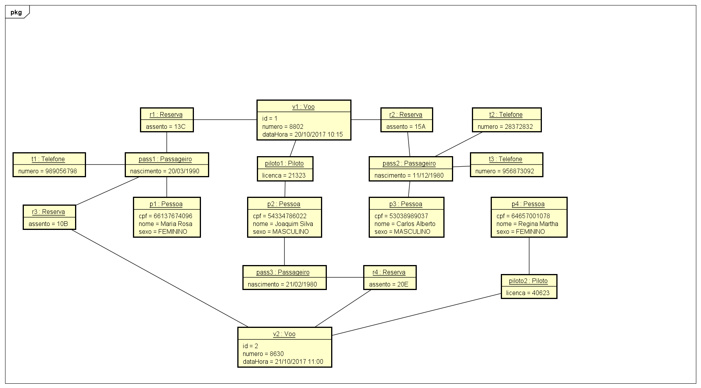

# 💻 Modelo Conceitual - nível de análise

## 📝 Exercícios PARTE 4: Herança, Enumerações e Tipos Primitivos
Para cada exercício, fazer:
- Desenhar o Modelo Conceitual
- Esboçar uma instância atendendo os requisitos mínimos pedidos

### Exercício 3

Deseja-se fazer um sistema para gerenciar informações de uma companhia aérea. Para isto, deve-se manter um cadastro das pessoas no sistema, sendo que é possível ter passageiros e pilotos. Toda pessoa possui cpf, nome e sexo, enquanto que pilotos possuem um número de licença de voo, e os passageiros possuem data de nascimento e um ou mais telefones. Quando um passageiro faz uma reserva de voo, deve ser registrado o assento deste passageiro no voo. O sistema também deve manter a informação de quem foi o piloto de cada voo, além do número, data e horário do voo.

*Instância mínima: 2 pilotos, 3 passageiros, 2 voos. Pelo menos um passageiro com mais de um telefone. Pelo menos um voo com mais de um passageiro. Um dos pilotos deve ser passageiro de um voo (obviamente não pilotado por ele).*

### Resolução

#### Modelo Conceitual

#### Instância
