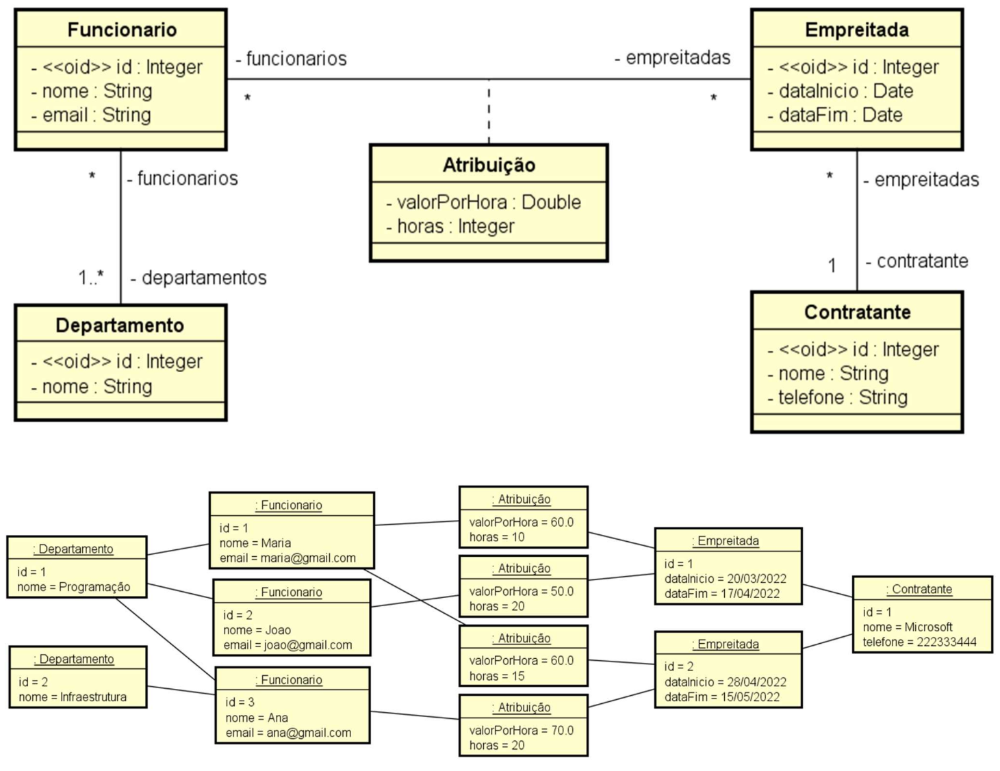

# 💻 Modelo Lógico Relacional - nível de design

## 📝 Desafio: Modelo Relacional Funcionários
A partir da visão geral do sistema, do modelo conceitual e sua instância, elabore a especificação textual equivalente do modelo relacional, bem como uma representação gráfica da instância dos dados na forma de tabelas.

### Visão geral do sistema

Deseja-se fazer um sistema para registrar os funcionários de uma empresa, bem como as empreitadas às quais eles são atribuídos ao longo do tempo. Cada funcionário possui nome e email, e pode pertencer a um ou mais departamentos. Cada empreitada possui uma data de início e de fim, e pode ter vários funcionários atribuídos a ela, sendo que cada atribuição de um funcionário em uma empreitada deve armazenar a quantidade de horas que o funcionário vai trabalhar na empreitada, bem como o valor por hora que o funcionário vai ganhar. Cada empreitada é contratada por uma empresa contratante, que possui nome e telefone.

### Resolução

[Clique aqui](solucao_desafioLogicoRelacional.pdf)