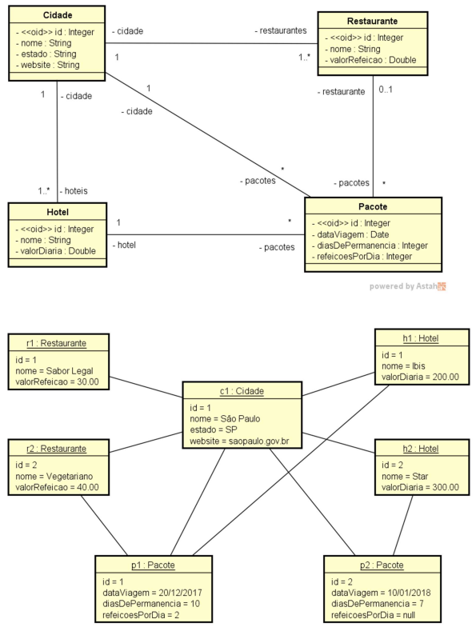

# 💻 Modelo Lógico Relacional - nível de design

## 📝 Exercícios
Para cada exercício, a partir da visão geral do sistema, do modelo conceitual e sua instância, elabore a especificação textual equivalente do modelo relacional, bem como uma representação gráfica da instância dos dados na forma de tabelas. 

### Exercício 1 (Turismo)

Deseja-se fazer um sistema para manter dados de cidades (nome, estado, website), onde cada cidade possui um ou mais restaurantes (nome, valor da refeição) e hotéis (nome, valor da diária). Além disso, deseja-se registrar pacotes turísticos vendidos. Para registrar um pacote turístico, deve-se escolher uma cidade, definir a data da viagem, o hotel de hospedagem e o número de dias de permanência. Deve-se também definir se no pacote vai estar incluso ou não um restaurante e, se sim, quantas refeições por dia serão consumidas.

*Instância mínima: 1 cidade, 2 hotéis e 2 restaurantes, 2 pacotes turísticos.*

