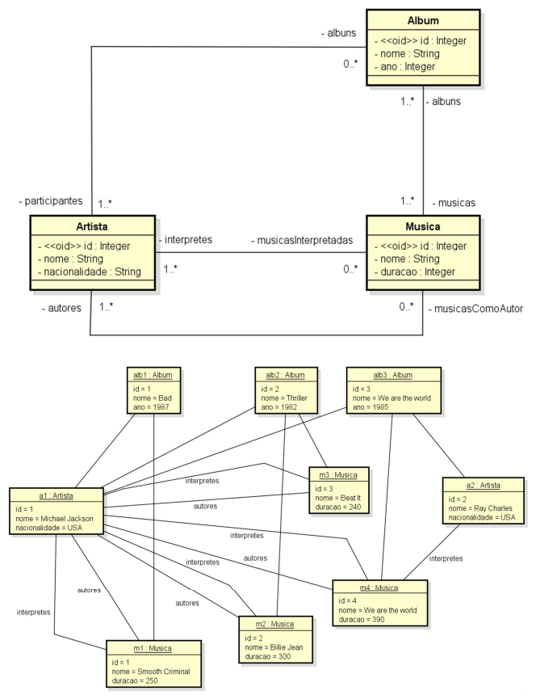

# 💻 Modelo Lógico Relacional - nível de design

## 📝 Exercícios
Para cada exercício, a partir da visão geral do sistema, do modelo conceitual e sua instância, elabore a especificação textual equivalente do modelo relacional, bem como uma representação gráfica da instância dos dados na forma de tabelas. 

### Exercício 2 (Artistas)

Deseja-se construir um sistema para manter um registro de artistas musicais e seus álbuns. Cada álbum possui várias músicas, as quais poderão ser consultadas pelo sistema. O sistema também deve permitir a busca de artistas por nome ou nacionalidade. O sistema também deve ser capaz de exibir um relatório dos álbuns de um artista, o qual pode ser ordenado por nome, ano, ou duração total do álbum. Um álbum pode ter a participação de vários artistas, sem distinção. Já a música pode possuir um ou mais autores e intérpretes (todos considerados artistas). 

*Instância mínima: 2 artistas, 3 álbuns, 4 músicas*

### Solução

[Clique aqui](exercicio2_solucao.pdf)