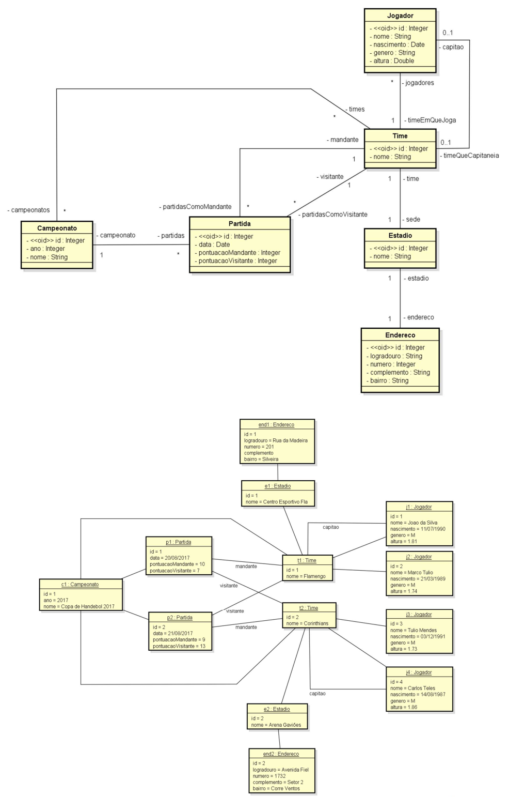

# 💻 Modelo Lógico Relacional - nível de design

## 📝 Exercícios
Para cada exercício, a partir da visão geral do sistema, do modelo conceitual e sua instância, elabore a especificação textual equivalente do modelo relacional, bem como uma representação gráfica da instância dos dados na forma de tabelas. 

### Exercício 3 (Handebol)

Deseja-se construir um sistema para gerenciar as informações de campeonatos de handebol, que ocorrem todo ano. Deseja-se saber nome, data de nascimento, gênero e altura dos jogadores de cada time, bem como qual deles é o capitão de cada time. Cada partida do campeonato ocorre em um estádio, que possui nome e endereço. Cada time possui seu estádio-sede e, assim, cada partida possui um time mandante (anfitrião) e o time visitante. O sistema deve ser capaz de listar as partidas já ocorridas e não ocorridas de um campeonato. O sistema deve também ser capaz de listar a tabela do campeonato, ordenando os times por classificação, que é calculada em primeiro lugar por saldo de vitórias e em segundo lugar por saldo de gols.

*Instância mínima: 1 campeonato, 2 partidas, 2 times, 2 jogadores em cada time*

### Solução

[Clique aqui](exercicio3_solucao.pdf)