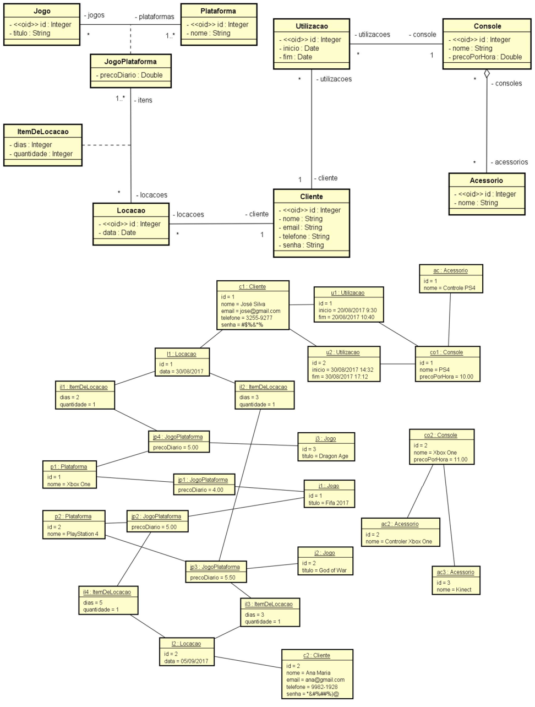

# 💻 Modelo Lógico Relacional - nível de design

## 📝 Exercícios
Para cada exercício, a partir da visão geral do sistema, do modelo conceitual e sua instância, elabore a especificação textual equivalente do modelo relacional, bem como uma representação gráfica da instância dos dados na forma de tabelas. 

### Exercício 4 (Jogos)

Deseja-se fazer um sistema para armazenar as informações de uma locadora de jogos digitais. Cada jogo pode rodar em mais de uma plataforma (Xbox, PS3, PS4, PC, etc.). Cada jogo possui seu preço diário de locação, sendo que um mesmo jogo pode ter preços de locação diferentes para cada plataforma. Quando um cliente (nome, email, telefone, senha) deseja fazer uma locação, ele informa quais jogos ele quer locar, informando inclusive de qual plataforma é cada jogo contido na locação a ser realizada. Quando a locação é realizada, a data atual deve ser registrada para esta locação. Para cada jogo locado, o cliente informa quantos dias ele deseja ficar com cada um (note que ele pode alugar, por exemplo, um jogo X da plataforma Xbox por 2 dias e um jogo Y da plataforma PC por 5 dias, tudo para a mesma locação). A locadora também possui alguns consoles de vídeo game, os quais podem ser usados no local pelos clientes por um certo intervalo de tempo. Cada console possui um preço por cada hora (ou fração) utilizada, e contém um conjunto de acessórios (headphone, controle, Kinect, etc.).

*Instância mínima: 2 plataformas, 2 jogos para cada plataforma, 2 clientes, 2 locações, 2 itens para cada locação, 2 consoles, pelo menos um console com mais de um acessório, pelo menos um cliente com mais de uma utilização de console.*

### Solução

[Clique aqui](exercicio4_solucao.pdf)