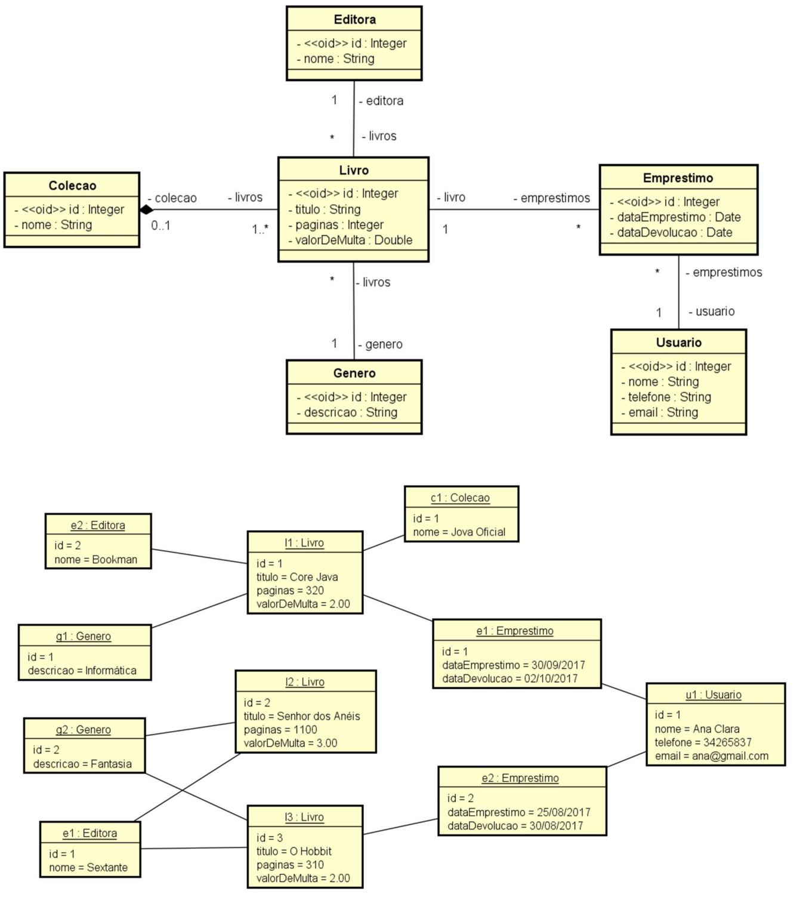

# 💻 Modelo Lógico Relacional - nível de design

## 📝 Exercícios
Para cada exercício, a partir da visão geral do sistema, do modelo conceitual e sua instância, elabore a especificação textual equivalente do modelo relacional, bem como uma representação gráfica da instância dos dados na forma de tabelas. 

### Exercício 5 (Biblioteca)

Uma biblioteca deseja fazer o registro de seus empréstimos de livros. Quando um usuário pega um livro emprestado, deve ser registrada a data de empréstimo. Por padrão, o prazo de empréstimo é de dois dias, considerando atraso se o livro for devolvido depois deste tempo. Cada livro possui um título, gênero, editora e número de páginas. Um livro pode participar de uma coleção. Cada livro também possui um valor diário de multa, caso o usuário devolva o livro com atraso em relação à data prevista de devolução.

*Instância mínima: 3 livros, 1 usuário, 2 empréstimos. Pelo menos um livro participando de uma coleção.*

### Solução

[Clique aqui](exercicio5_solucao.pdf)