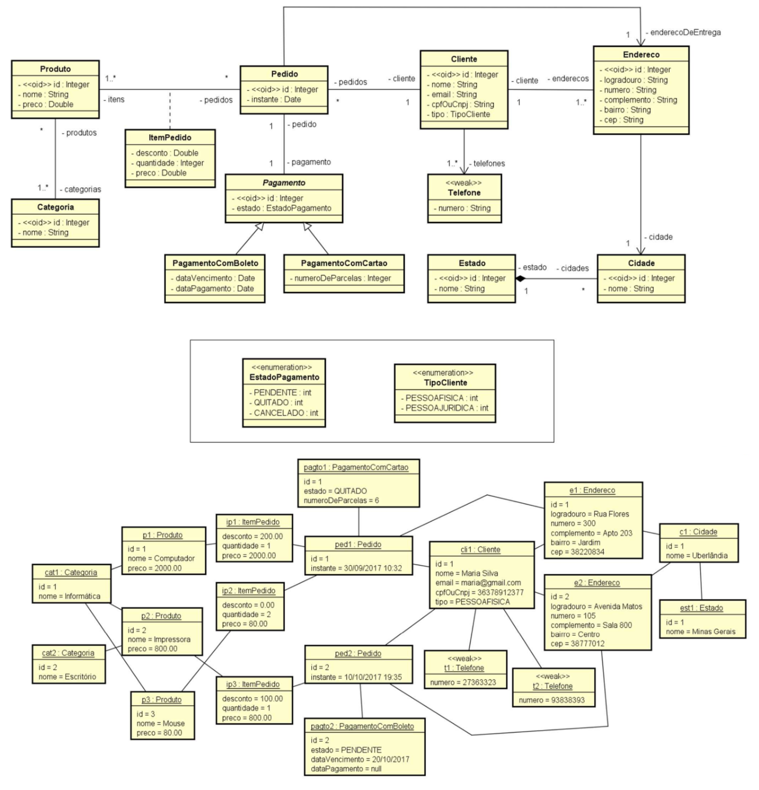

# 💻 Modelo Lógico Relacional - nível de design

## 📝 Exercícios
Para cada exercício, a partir da visão geral do sistema, do modelo conceitual e sua instância, elabore a especificação textual equivalente do modelo relacional, bem como uma representação gráfica da instância dos dados na forma de tabelas. 

### Exercício 6 (Pedidos)

Deseja-se fazer um sistema de pedidos. Um ou mais produtos podem ser vendidos em cada pedido, sendo que a cada produto pode ser dado um desconto diferente, e também cada produto pode ser vendido em uma ou mais unidades. Cada produto possui nome e preço, e pode pertencer a várias categorias. Cada pedido é feito por um cliente, que deve ter em seu cadastro nome, telefones, email, cpf ou cnpj, e um ou mais endereços, sendo que o cliente deve especificar um endereço para entrega na hora de comprar. Para um pedido, deve ser registrado o instante em que é realizado e o endereço de entrega. Um pedido deve ser pago ou por boleto, ou por cartão de crédito. No caso de boleto, deve-se armazenar a data de vencimento e a data de pagamento. No caso de cartão de crédito, deve-se armazenar o número de parcelas. Todo pagamento possui um estado (pendente, quitado ou cancelado).

*Instância mínima: 1 cliente, 3 produtos, 2 pedidos, pelo menos um pedido com mais de um produto, pelo menos um pedido pago com cartão de crédito e um com boleto.*

### Solução

[Clique aqui](exercicio6_solucao.pdf)