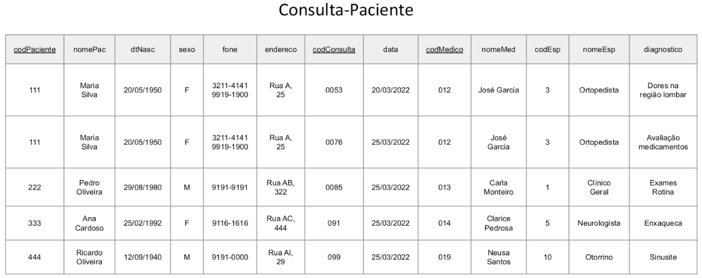

# 💻 Normalização

## 📝 Desafio: Normalização Pacientes
Com base na (1) visão geral do sistema, (2) especificação textual do esquema e (3) instância do modelo abaixo, aplique o procedimento de normalização e produza um novo modelo relacional normalizado, bem como o desenho atualizado da instância do modelo na forma de tabelas. Você deverá produzir um documento contendo: (1) Especificação textual do esquema, e (2) Instância do modelo.

### Visão geral do sistema
Deseja-se fazer um sistema para registrar as consultas de um paciente. O paciente pode realizar várias consultas e uma consulta é registrada para um único paciente. Para cada consulta deve-se registrar a data da consulta, o médico que realizou o atendimento e o diagnóstico do paciente. Um médico pode realizar várias consultas e uma consulta é realizada por um médico.

### Especificação textual do esquema (não normalizado)
Consulta-Paciente (<u>codPaciente</u>, nomePac, dtNasc, sexo, fone, endereco,
<u>codConsulta</u>, data, <u>codMedico</u>, nomeMed, codEsp, nomeEsp, diagnostico)

### Instância do modelo (não normalizado)

## Resolução
[Clique aqui](solucao_desafioNormalizacao.pdf)