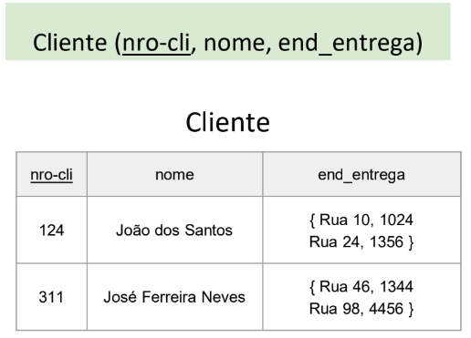

# 💻 Normalização

## 📝 Exercícios
Para cada exercício, aplique a normalização na relação e elabore a especificação textual equivalente do modelo relacional, bem como uma representação gráfica da instância dos dados na forma de tabelas. 

### Exercício 3 (Cliente)

### Solução

[Clique aqui](exerciciorelacao3_solucao.pdf)