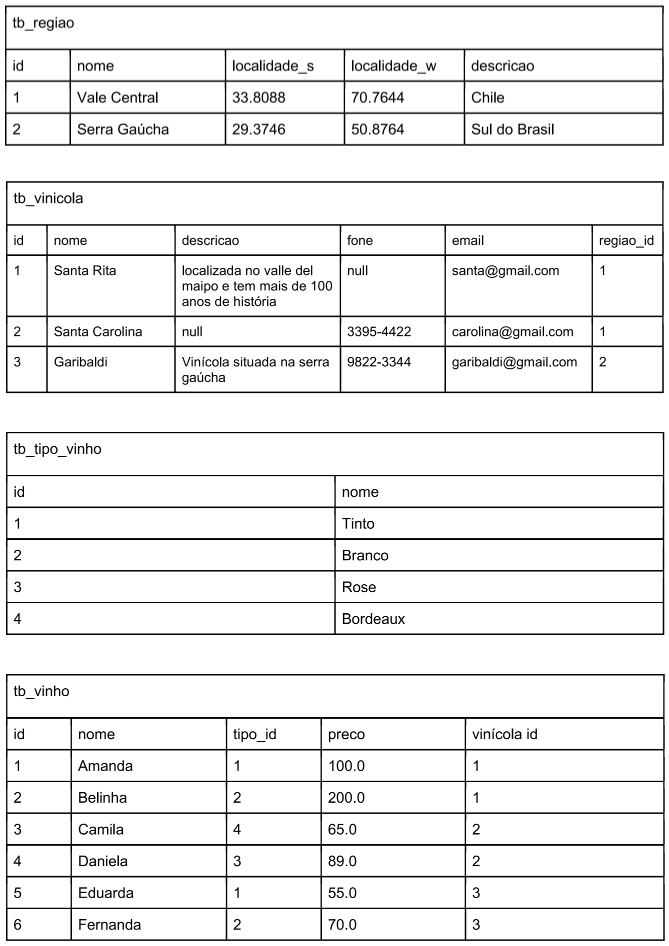

# 💻 SQL - DDL e DML

## 📝 Desafio: Script de criação de tabelas e seed
Com base na (1) visão geral do sistema, (2) especificação textual do esquema e (3) modelo de instância fornecidos, você deve: criar as tabelas correspondentes ao esquema e fazer o seed no banco de banco de dados
com base no modelo de instâncias fornecido.

### Visão geral do sistema
Deseja-se fazer um sistema para registrar a produção de vinhos nas vinícolas. Uma vinícola pode produzir muitos vinhos e um vinho é produzido por uma única vinícola. Cada vinícola está situada em uma região. Por outro lado, em uma região podem estar situadas várias vinícolas. A partir do esquema textual e do modelo de instância, faça o script.sql com os comandos DDL para criar as tabelas correspondentes ao esquema fornecido. Na sequência, faça os comandos DML para inclusão dos registros nas tabelas, com base no modelo de instâncias.

### Especificação textual do esquema

tb_regiao (<ins>id</ins>, nome, localidade_s, localidade_w, descricao)  

tb_vinicola (<ins>id</ins>, nome, descricao, fone, email, regiao_id)  
    regiao_id referencia tb_regiao  

tb_tipo_vinho (<ins>id</ins>, nome)  

tb_vinho (<ins>id</ins>, nome, tipo_id, preco, vinicola_id)  
    tipo_id referencia tb_tipo_vinho  
    vinicola_id referencia tb_vinicola

### Instância

## Resolução
[Clique aqui](solucao_desafioCriacao_seed.sql)