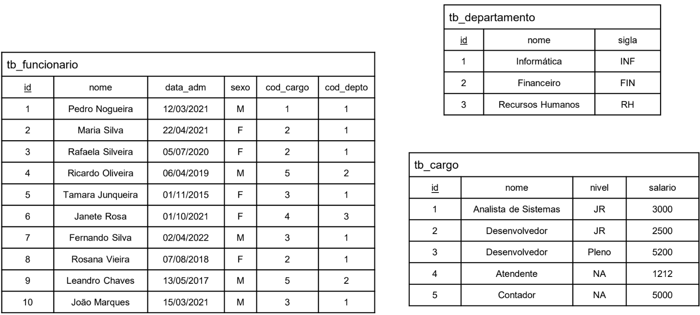

# 💻 SQL - DDL e DML

## 📝 Exercícios

### Exercício 1 (Script DB Create)

De acordo com o esquema a seguir, faça um script de criação para o banco de dados "empresa" e suas tabelas. Também, faça o seed no banco de dados de acordo com as instâncias fornecidas.

tb_cargo (<ins>id</ins>, nome, nivel, salario)  
tb_departamento (<ins>id</ins>, nome, sigla)  
tb_funcionario (<ins>id</ins>, nome, data_adm, sexo, cod_cargo, cod_depto)  
    cod_cargo referencia tb_cargo  
    cod_dpto referencia tb_departamento  

### Instância

### Solução

[Clique aqui](exercicio1_scriptdb.sql)