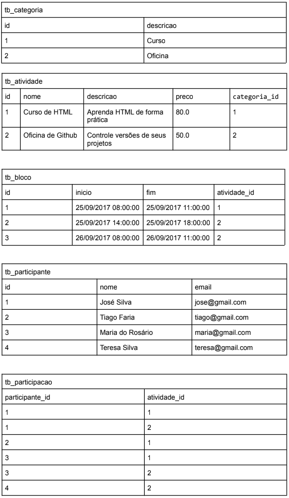

# 💻 SQL - DDL e DML

## 📝 Exercícios

### Exercício 2 (Evento)

Para cada exercício, a partir da especificação textual do esquema e da instância de dados, elabore o script SQL (DDL e DML) para criação das tabelas e para seed no banco de dados.

tb_categoria (<ins>id</ins>, descricao)  
tb_atividade (<ins>id</ins>, nome, descricao, preco, categoria_id)  
    categoria_id referencia tb_categoria  
tb_bloco (<ins>id</ins>, inicio, fim, atividade_id)  
    atividade_id referencia tb_atividade  
tb_participante (<ins>id</ins>, nome, email)  
tb_participacao (<ins>participante_id</ins>, <ins>atividade_id</ins>)  
    participante_id referencia tb_participante  
    atividade_id referencia tb_atividade  

### Instância

### Solução

[Clique aqui](exercicio2_evento.sql)