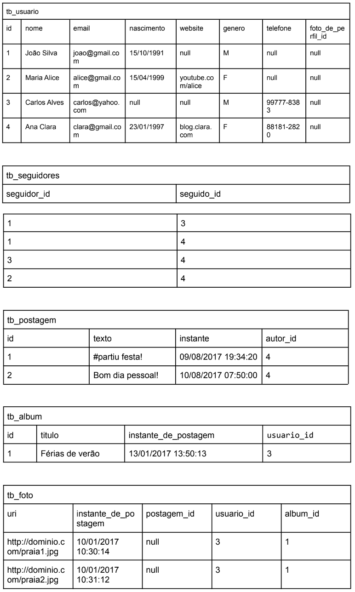

# 💻 SQL - DDL e DML

## 📝 Exercícios

Para cada exercício, a partir da especificação textual do esquema e da instância de dados, elabore o script SQL (DDL e DML) para criação das tabelas e para seed no banco de dados.

### Exercício 3 (Rede-social)

tb_usuario (<ins>id</ins>, nome, email, nascimento, website, gereno, telefone, foto_de_perfil_id)  
    foto_de_perfil_id referencia tb_foto  

tb_seguidores (<ins>seguidor_id</ins>, <ins>seguido_id</ins>)  
    seguidor_id referencia tb_usuario  
    seguido_id referencia tb_usuario  

tb_postagem (<ins>id</ins>, texto, instante, autor_id)  
    autor_id referencia tb_usuario  

tb_album (<ins>id</ins>, titulo, instante_de_postagem, usuario_id)  
    usuario_id referencia tb_usuario  

tb_foto (<ins>uri</ins>, instante_de_postagem, postagem_id, usuario_id, album_id)  
    postagem_id referencia tb_postagem  
    usuario_id referencia tb_usuario  
    album_id referencia tb_album  

### Instância

### Solução

[Clique aqui](exercicio3_rede.sql)