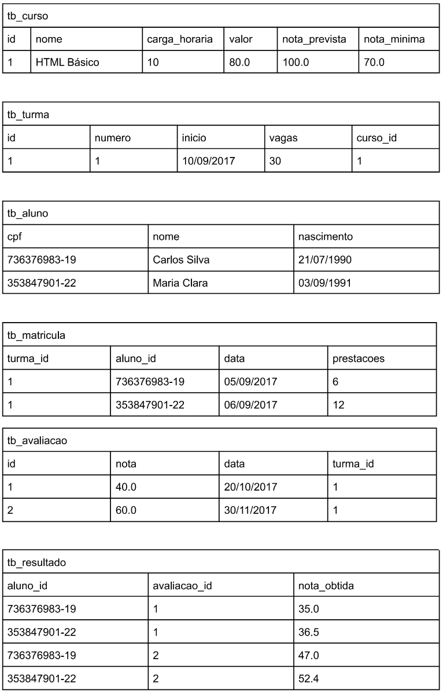

# 💻 SQL - DDL e DML

## 📝 Exercícios

Para cada exercício, a partir da especificação textual do esquema e da instância de dados, elabore o script SQL (DDL e DML) para criação das tabelas e para seed no banco de dados.

### Exercício 4 (Escola)

tb_curso (<ins>id</ins>, nome, carga_horaria, valor, nota_prevista, nota_minima)  

tb_turma (<ins>id</ins>, numero, inicio, vagas, curso_id)  
    curso_id referencia tb_curso  

tb_aluno (<ins>cpf</ins>, nome, nascimento)  

tb_matricula (<ins>turma_id</ins>, <ins>aluno_id</ins>, data, prestacoes)  
    turma_id referencia tb_turma  
    aluno_id referencia tb_aluno  

tb_avaliacao (<ins>id</ins>, nota, data, turma_id)  
    turma_id referencia tb_turma  

tb_resultado (<ins>aluno_id</ins>, <ins>avalicao_id</ins>, nota_obtida)  
    aluno_id referencia tb_aluno  
    avaliacao_id referencia tb_avaliacao

### Instância

### Solução

[Clique aqui](exercicio4_escola.sql)