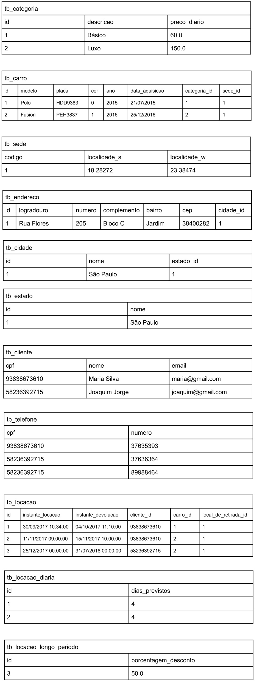

# 💻 SQL - DDL e DML

## 📝 Exercícios

Para cada exercício, a partir da especificação textual do esquema e da instância de dados, elabore o script SQL (DDL e DML) para criação das tabelas e para seed no banco de dados.

### Exercício 5 (Carros)

tb_categoria (<ins>id</ins>, descricao, preco_diario)  

tb_carro (<ins>id</ins>, modelo, placa, cor, ano, data_aquisicao, categoria_id, sede_id)  
    categoria_id referencia tb_categoria  
    sede_id referencia tb_sede  

tb_sede (<ins>codigo</ins>, localidade_s, localidade_w)  

tb_endereco (<ins>id</ins>, logradouro, numero, complemento, bairro, cep, cidade_id)  
    id referencia tb_sede  
    cidade_id referencia tb_cidade  

tb_cidade (<ins>id</ins>, nome, estado_id)  
    estado_id referencia tb_estado  

tb_estado (<ins>id</ins>, nome)  

tb_cliente (<ins>cpf</ins>, nome, email)  

tb_telefone (<ins>cpf</ins>, <ins>numero</ins>)  
    cpf referencia tb_cliente  

tb_locacao (<ins>id</ins>, instante_locacao, instante_devolucao, cliente_id, carro_id, local_de_retirada_id)  
    cliente_id referencia tb_cliente  
    carro_id referencia tb_carro  
    local_de_retirada_id referencia tb_sede  

tb_locacao_diaria (<ins>id</ins>, dias_previstos)  
    id referencia tb_locacao  

tb_locacao_longo_periodo (<ins>id</ins>, porcentagem_desconto)  
    id referencia tb_locacao  

### Instância

### Solução
[Clique aqui](exercicio5_carros.sql)