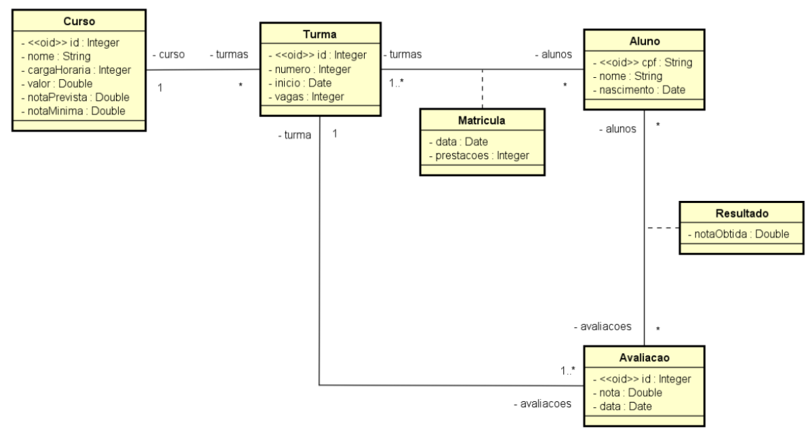

# 💻 Consultas SQL

## 📝 Desafio: Consultas SQL

Em um sistema acadêmico, são registrados os cursos disponíveis, onde cada um possui um nome, carga horária e valor. Quando um curso vai ser oferecido, é registrada uma turma, informando os seguintes dados: número da turma, data de início e número de vagas. Uma matrícula de um aluno em uma turma consiste na data de matrícula e no número de prestações em que o aluno vai pagar o curso. Para cada aluno, é necessário cadastrar seu nome, cpf, e data de nascimento. Cada aluno passa por várias avaliações durante o desenrolar do curso que está cursando. Uma avaliação possui nota e data. Depois que a avaliação ocorre, é registrado resultado de cada aluno da turma (a nota que ele tirou). Um aluno é aprovado em um curso se sua nota total for maior ou igual à nota mínima de aprovação prevista para o curso.

### Instância do banco de dados

**tb_curso**

| id | nome         | carga_horaria | valor | nota_prevista | nota_minima |
|----|--------------|---------------|-------|---------------|-------------|
| 1  | HTML Básico  | 10            | 80.0  | 100.0         | 70.0        |

**tb_turma**

| id | numero | inicio     | vagas | curso_id |
|----|--------|------------|-------|----------|
| 1  | 1      | 10/09/2017 | 30    | 1        |
| 2  | 10     | 20/05/2022 | 30    | 1        |

**tb_aluno**

| cpf           | nome        | nascimento  |
|---------------|-------------|-------------|
| 736376983-19  | Carlos Silva| 21/07/1990  |
| 353847901-22  | Maria Clara | 03/09/1991  |
| 444123123-44  | Ana Portes  | 21/05/1995  |
| 555098098-55  | Pedro Tiago | 15/10/2001  |

**tb_matricula**

| turma_id | aluno_id      | data       | prestacoes |
|----------|---------------|------------|------------|
| 1        | 736376983-19  | 05/09/2017 | 6          |
| 1        | 353847901-22  | 06/09/2017 | 12         |
| 2        | 736376983-19  | 13/05/2022 | 1          |
| 2        | 444123123-44  | 13/05/2022 | 6          |
| 2        | 555098098-55  | 15/05/2022 | 10         |

**tb_avaliacao**

| id | nota | data       | turma_id |
|----|------|------------|----------|
| 1  | 40.0 | 20/10/2017 | 1        |
| 2  | 60.0 | 30/11/2017 | 1        |
| 3  | 50.0 | 20/06/2022 | 2        |
| 4  | 50.0 | 20/07/2022 | 2        |

**tb_resultado**

| aluno_id      | avaliacao_id | nota_obtida |
|---------------|--------------|-------------|
| 736376983-19  | 1            | 35.0        |
| 353847901-22  | 1            | 36.5        |
| 736376983-19  | 2            | 47.0        |
| 353847901-22  | 2            | 52.4        |
| 736376983-19  | 3            | 30.0        |
| 444123123-44  | 3            | 50.0        |
| 555098098-55  | 3            | 40.0        |
| 736376983-19  | 4            | 35.0        |
| 444123123-44  | 4            | 45.0        |
| 555098098-55  | 4            | 35.5        |

### Consultas a serem feitas

Você deve criar as consultas SQL para responder cada uma das seguintes questões (favor
salvar todas consultas em um mesmo arquivo .sql no Gist). Atenção: você deve respeitar os
nomes dos campos conforme o exemplo de saída.

#### QUESTÃO 1: nome do curso, número e data de início de cada turma de cada curso.

**Exemplo de saída:**

| curso       | turma | inicio     |
|-------------|-------|------------|
| HTML Básico | 1     | 2017-09-10 |
| HTML Básico | 10    | 2022-05-20 |

#### QUESTÃO 2: nome do curso, número da turma, nome e CPF dos alunos de cada curso e cada turma. Os nomes das colunas devem ser curso, turma, aluno e cpf, conforme exemplo.

**Exemplo de saída:**

| curso       | turma | aluno       | cpf           |
|-------------|-------|-------------|---------------|
| HTML Básico | 1     | Maria Clara | 353847901-22  |
| HTML Básico | 1     | Carlos Silva| 736376983-19  |
| HTML Básico | 10    | Pedro Tiago | 555098098-55  |
| HTML Básico | 10    | Ana Portes  | 444123123-44  |
| HTML Básico | 10    | Carlos Silva| 736376983-19  |

#### QUESTÃO 3: listagem de data e nota de todas avaliações já ocorridas, juntamente com nome, nota obtida por cada aluno em cada avaliação, e também qual a porcentagem de nota obtida em relação à nota da avaliação. Os resultados devem estar ordenados da avaliação mais recente para a mais antiga, e, para cada avaliação, os nomes dos alunos devem estar ordenados em ordem crescente. A porcentagem deve ter duas casas decimais.

**Exemplo de saída:**

| data       | nota | nome        | nota_obtida | porcentagem |
|------------|------|-------------|-------------|-------------|
| 2022-07-20 | 50.0 | Ana Portes  | 45.0        | 90.00       |
| 2022-07-20 | 50.0 | Carlos Silva| 35.0        | 70.00       |
| 2022-07-20 | 50.0 | Pedro Tiago | 35.5        | 71.00       |
| 2022-06-20 | 50.0 | Ana Portes  | 50.0        | 100.00      |
| 2022-06-20 | 50.0 | Carlos Silva| 30.0        | 60.00       |
| 2022-06-20 | 50.0 | Pedro Tiago | 40.0        | 80.00       |
| 2017-11-30 | 60.0 | Carlos Silva| 47.0        | 78.33       |
| 2017-11-30 | 60.0 | Maria Clara | 52.4        | 87.33       |
| 2017-10-20 | 40.0 | Carlos Silva| 35.0        | 87.50       |
| 2017-10-20 | 40.0 | Maria Clara | 36.5        | 91.25       |

#### QUESTÃO 4: nome e nota total dos alunos da turma 10 (ATENÇÃO: você deve restringir a turma pelo número 10 dela, e não pelo id 2).

**Exemplo de saída:**
| nome         | total |
|--------------|-------|
| Ana Portes   | 95.0  |
| Carlos Silva | 65.0  |
| Pedro Tiago  | 75.5  |

### Resolução
[Clique aqui](desafioConsultasSQL.sql)