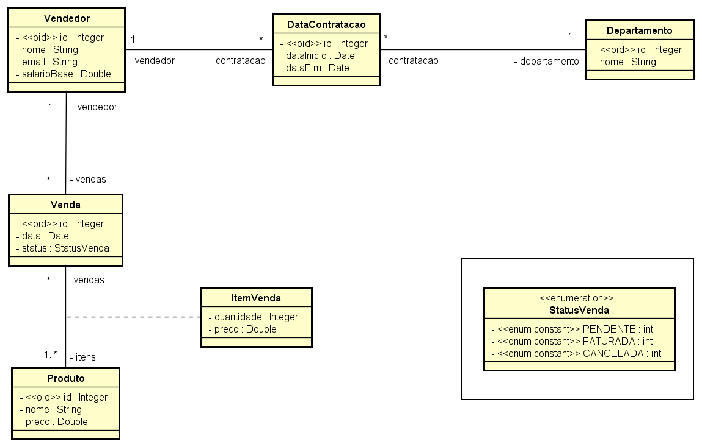
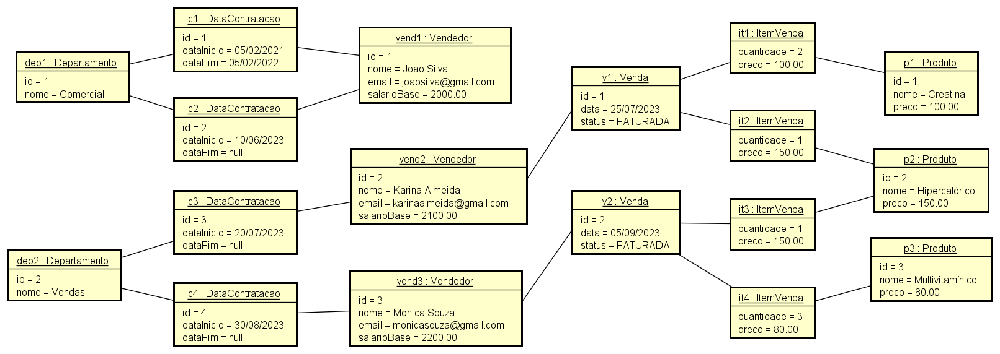

# 💻 Modelo Conceitual - nível de análise

## 📝 Desafio: Modelo Conceitual Vendas
Tarefa: com base na visão geral de sistema abaixo, faça:
- O modelo conceitual usando o diagrama de classes da UML
- Esboce uma instância do modelo, atendendo os requisitos mínimos pedidos

### Enunciado

Deseja-se fazer um sistema para armazenar informações de vendas e vendedores de uma empresa. Cada vendedor possui um id, nome, email e salário base. Cada vendedor pertence a um departamento, sendo que se deve conhecer a data de início e fim da contratação de cada vendedor no departamento (nota: se a contração do vendedor no departamento ainda não terminou, a data de fim deverá ser nula). Ao longo do tempo, o mesmo vendedor pode ser removido de um departamento e contratado para outro, podendo inclusive ser recontratado para o departamento em uma data futura. Deseja-se também registrar as vendas realizadas pelos vendedores. Cada venda possui uma data e um status (pendente, faturada ou cancelada), e pode ter um ou mais itens, sendo que cada item de venda corresponde a um produto, que pode ser vendido em quantidade 1 ou superior. Os dados do produto são nome e preço.

*3 produtos, 2 vendas, pelo menos 2 itens por venda, 3 vendedores, 2 departamentos, pelo menos 2 contratações por departamento.*

### Resolução

#### Modelo Conceitual

#### Instância
