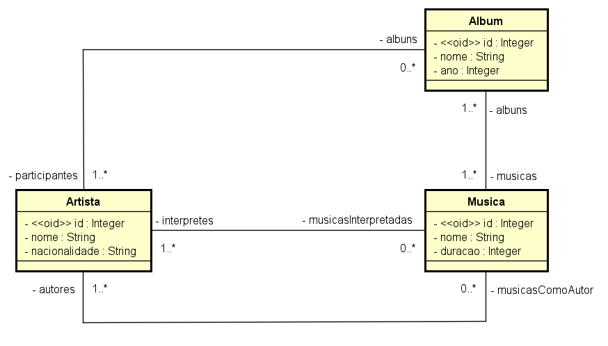

# 💻 Modelo Conceitual - nível de análise

## 📝 Exercícios PARTE 2: Associações e multiplicidade de papéis
Para cada exercício, fazer:
- Desenhar o Modelo Conceitual
- Esboçar uma instância atendendo os requisitos mínimos pedidos

### Exercício 1

Deseja-se construir um sistema para manter um registro de artistas musicais e seus álbuns. Cada álbum possui várias músicas, as quais poderão ser consultadas pelo sistema. O sistema também deve permitir a busca de artistas por nome ou nacionalidade. O sistema também deve ser capaz de exibir um relatório dos álbuns de um artista, o qual pode ser ordenado por nome, ano, ou duração total do álbum. Um álbum pode ter a participação de vários artistas, sem distinção. Já a música pode possuir um ou mais autores e intérpretes (todos considerados artistas).

*Instância mínima: 2 artistas, 3 álbuns, 4 músicas*

### Resolução

#### Modelo Conceitual

#### Instância

