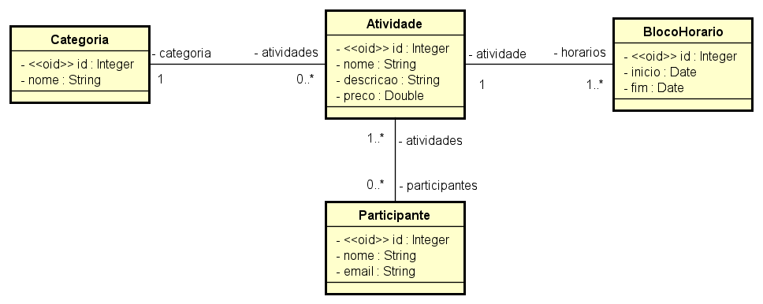
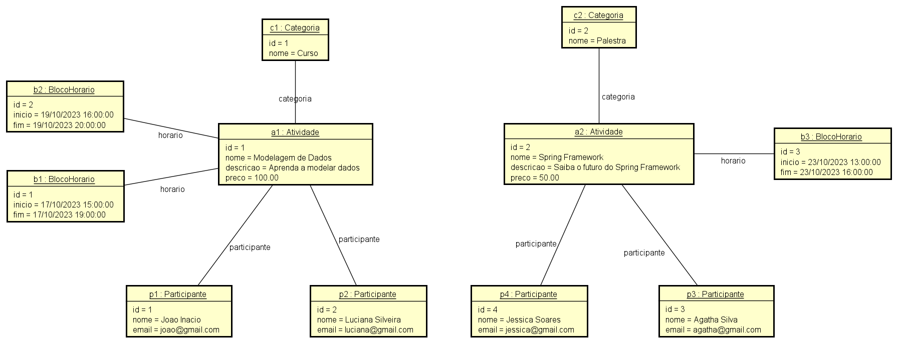

# 💻 Modelo Conceitual - nível de análise

## 📝 Exercícios PARTE 2: Associações e multiplicidade de papéis
Para cada exercício, fazer:
- Desenhar o Modelo Conceitual
- Esboçar uma instância atendendo os requisitos mínimos pedidos

### Exercício 4

Deseja-se construir um sistema para gerenciar as informações dos participantes das atividades de um evento acadêmico. As atividades deste evento podem ser, por exemplo, palestras, cursos, oficinas práticas, etc. Cada atividade que ocorre possui nome, descrição, preço, e pode ser dividida em vários blocos de horários (por exemplo: um curso de HTML pode ocorrer em dois blocos, sendo necessário armazenar o dia e os horários de início de fim do bloco daquele dia). Para cada participante, deseja-se cadastrar seu nome e email.

*Instância mínima: 2 atividades, 4 participantes, pelo menos uma atividade com mais de um bloco de horários.*

### Resolução

#### Modelo Conceitual

#### Instância
