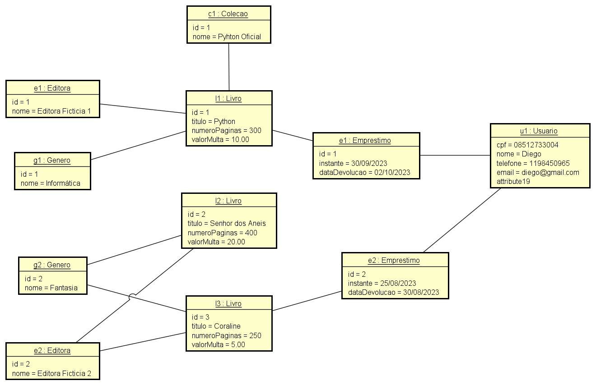

# 💻 Modelo Conceitual - nível de análise

## 📝 Exercícios PARTE 3: Associações todo-parte e classe de associação
Para cada exercício, fazer:
- Desenhar o Modelo Conceitual
- Esboçar uma instância atendendo os requisitos mínimos pedidos

### Exercício 2

Uma biblioteca deseja fazer o registro de seus empréstimos de livros. Quando um usuário pega um livro emprestado, deve ser registrada a data de empréstimo. Por padrão, o prazo de empréstimo é de dois dias, considerando atraso se o livro for devolvido depois deste tempo. Cada livro possui um título, gênero, editora e número de páginas. Um livro pode participar de uma coleção. Cada livro também possui um valor diário de multa, caso o usuário devolva o livro com atraso em relação à data prevista de devolução. 

*Instância mínima: 3 livros, 1 usuário, 2 empréstimos. Pelo menos um livro participando de uma coleção.*

### Resolução

#### Modelo Conceitual

#### Instância
